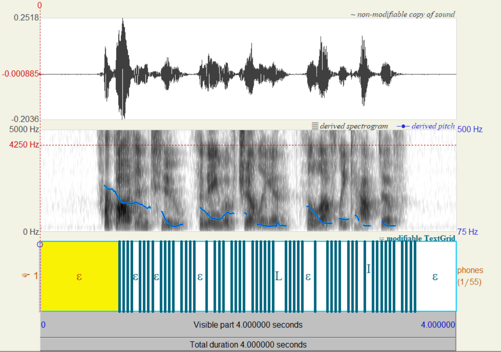

# Alignment Decoding task from UCU Acoustic School

Task can be found [here](https://www.overleaf.com/project/6447d67ef9f40594edaaf0d8).

Based on start code from [here](https://gist.github.com/proger/a7e820fbfa0181273fdbf2351901d0d8).

Should be used in pair with [Praat](https://www.fon.hum.uva.nl/praat/).

## Results

I created 2703 text segmentation files from LibriSpeech dev-clean dataset using provided LSTM 
acoustic model and watched some of them in Praat special software.

> Warning: there were several (less then 100) errors of unknown origin while creating segmentations.

We can see analisation example for sample 174-50561-0:

